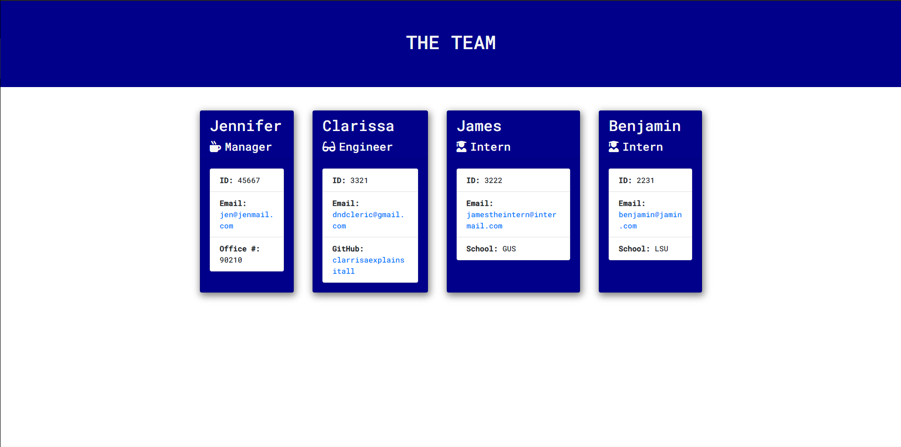

# NODE JS TEAM SITE GENERATOR

[GitHub Site](https://github.com/modern-sapien/node-js-team-site-generator)

### Click the image to see the generator in action!

# Table of Contents
* [Description](#Description)
* [Installation](#Installation)
* [Usage](#Usage)
* [Contributions](#Contribute)
* [Tests](#Tests)
* [Questions](#Questions)

## Description
Through the use of Node.js a command line takes in user responses to dynamically generate a web page displaying engineer team members. This project was an assigment from the Georgia Tech Full Stack Development bootcamp to expand on understanding of Node.js, Node Package Manager & test driven development. 

This project provides a great example of using the CLI to generate classes which then dynamically generate new web content easily & efficiently. What I love practicing and learning the most during this project was how to properly use async/await to avoid a very miniversion of callback hell & how returns can be used in place of variables to also avoid asynchronicity.

## Installation
Clone from the provided github SSH keys in the linked github repo. and navigate to through the CLI and run node index.js"

## Usage
This project can be used for any non-paid uses and can be customized to present an array of different teams and team members.

## License
This project is licensed by, MIT for more information regarding licensing feel free to visit
[choose a license](https://choosealicense.com/)

## Contribute
Please reach out to modern-sapien at joncanales2@gmail.com.

## Tests
There are tests included in this project for the classes & subclasses, more tests can be written for the inquirer calls & instatiation of classes.

## Questions 
For Questions please contact, Jonathan Canales at joncanales2@gmail.com.
  
